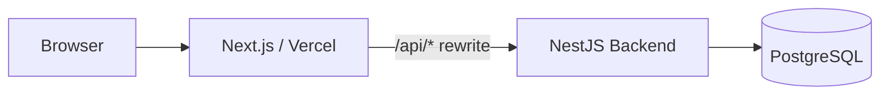
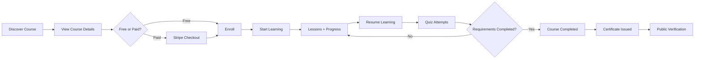
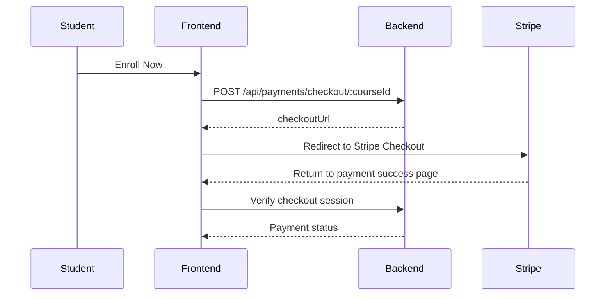

<div align="center">

# 🎓 LMS Frontend — Next.js

### User-facing application for a full Learning Management System with integrated AI-assisted learning and authoring workflows

**Next.js 16 · React 19 · TypeScript · Tailwind CSS 4 · TanStack Query · Axios · Zod · React Hook Form**

[Live Demo](https://lms-next-rust.vercel.app)

</div>

---

## 📌 Overview

This repository contains the frontend for a full Learning Management System supporting separate experiences for **students, instructors, and administrators**.

The application covers the complete learning journey:

- discover and filter courses
- view course details
- enroll in free or paid courses
- continue from the last saved learning position
- study lesson media
- take timed quizzes with multiple attempts
- track course progress
- write eligible course reviews
- complete courses
- view and verify certificates
- manage courses, learners, quizzes, question banks, and approvals
- use AI-assisted learning and instructor tools through the backend API

The frontend follows a **feature-based modular architecture** and communicates with the backend through a **same-origin Next.js `/api` rewrite** in production.

---

# ✨ Core Product Capabilities

## 👨‍🎓 Student Experience

Students can:

- browse and filter courses
- view public course details
- enroll in free courses
- pay for premium courses through Stripe Checkout
- access a personal learning dashboard
- resume from the last saved learning position
- consume lesson media:
  - video
  - audio
  - documents
  - external URLs
- track course progress
- take quizzes with:
  - countdown timers
  - multiple attempts
  - question navigation
  - saved answers
  - auto-submit on expiration
  - pass/fail results
  - earned marks
- submit course reviews when eligible
- view earned certificates
- share or print certificates
- open public certificate verification pages
- manage profile data
- receive in-app notifications

## 👨‍🏫 Instructor Experience

Instructors can:

- create and update courses
- manage draft and published course content
- submit courses for admin review
- organize courses into sections
- manage lessons and lesson media
- create question banks
- create questions and answer choices
- configure quizzes
- view enrolled students
- manage course certificates
- monitor course statistics

## 🛡️ Admin Experience

Admins can:

- view platform-level statistics
- manage users
- manage categories
- inspect courses and enrollments
- review submitted courses
- approve or reject pending courses

---

# 🤖 AI Integration

The frontend AI integration lives under:

```text
app/_modules/ai
```

This repository demonstrates **API consumption, UI integration, response contracts, query state, and rendering behavior**.

It does **not** independently define the active AI provider, embedding pipeline, vector persistence, background queue processing, or backend authorization rules.

## AI Frontend Data Flow

```text
Page / View
   ↓
TanStack Query Hook
   ↓
resAi / IAiAPI
   ↓
Shared Axios Client
   ↓
Next.js /api Rewrite
   ↓
Backend API
```

The frontend does not use any AI provider SDK or provider credentials directly.

Relevant frontend dependencies include:

- `@tanstack/react-query`
- `axios`
- `react-markdown`
- `remark-gfm`
- `zod`
- `react-toastify`

---

## 🎓 Student-Facing AI Features

### Course Assistant
- integrated into the student course page
- loads persisted conversation history from the backend
- submits questions for the current course
- assistant responses can include retrieval sources

### Lesson Assistant
- integrated into the lesson learning view
- loads persisted lesson conversation history
- submits questions for the current lesson
- assistant responses can include retrieval sources

### Lesson Summaries
Students can:

- request a generated lesson summary
- retrieve a previously generated summary
- regenerate the summary

### Study Plans
Students can:

- request a generated study plan for a course
- retrieve an existing plan
- regenerate the plan

> The current UI does not collect personal goals, available hours, or scheduling preferences as generation inputs.

### Student Quiz Performance Analysis
The quiz learning view can display:

- AI analysis report
- pass/fail state
- passing threshold
- best score
- latest score
- attempt count
- incorrect answers
- unanswered questions

Existing non-AI quiz statistics remain separate from the generated AI analysis.

---

## 👨‍🏫 Instructor-Facing AI Features

Instructor-facing integrations include:

- AI-generated lesson suggestions for a course
- AI-generated quiz-question suggestions based on a lesson
- AI-generated course-level quiz content
- AI aggregate quiz-performance analysis
- retrieval of previously generated suggestions and reports

Generated lesson and quiz suggestions are rendered as text/Markdown.

> Generated AI content is not automatically imported into canonical LMS lesson, quiz, question, or question-bank records by the inspected frontend flows.

---

# 💬 AI Conversation Behavior

A shared `AiAssistant` component handles course and lesson conversations.

Implemented behavior includes:

- backend-backed history loading
- query invalidation after successful question submission
- explicit loading, error, empty, and pending UI states
- duplicate-submission prevention while a request is pending
- question trimming and empty-input rejection
- textarea limit of 1,000 characters
- failed-question restoration
- formatted message timestamps
- Markdown rendering with GFM support
- collapsible retrieval-source lists

Displayed source metadata can include:

- source count
- page number
- chunk number
- short content excerpt

Source contracts can also contain media IDs, similarity scores, and time ranges, but those values are not currently exposed as playable timestamps, source navigation, or score indicators.

AI responses use ordinary HTTP requests. There is currently no streaming, SSE, or WebSocket AI response flow.

---

# 🧠 AI Query State & Client Caching

AI queries are grouped under the `"ai"` query-key namespace.

Current patterns include:

- resource-scoped query keys
- generated-result retrieval through GET endpoints
- `setQueryData` after generation/analysis mutations
- conversation-history invalidation after assistant mutations
- backend `cached` flag handling in generated-result views
- regenerate actions that repeat the generation request
- five-minute shared `staleTime`
- no automatic query retry
- no refetch on window focus
- `gcTime: 0`

Backend result reuse and TanStack Query caching are separate concerns. Fingerprints and backend content-change detection are not generated by the frontend.

---

# 🔌 AI API Routes Consumed by the Frontend

## POST

```text
/api/courses/:courseId/ai/ask
/api/lessons/:lessonId/ai/ask
/api/lessons/:lessonId/ai/summary
/api/courses/:courseId/ai/quiz/generate
/api/lessons/:lessonId/ai/quiz/generate
/api/courses/:courseId/ai/lessons/generate
/api/quizzes/:quizId/ai/performance
/api/quizzes/:quizId/ai/instructor-analysis
/api/courses/:courseId/ai/study-plan
```

## GET

```text
/api/courses/:courseId/ai/history
/api/lessons/:lessonId/ai/history
/api/lessons/:lessonId/ai/summary/generated
/api/courses/:courseId/ai/quiz/generated
/api/lessons/:lessonId/ai/quiz/generated
/api/courses/:courseId/ai/lessons/generated
/api/quiz-performance/:quizId
/api/quizzes/:quizId/ai/instructor-analysis
/api/courses/:courseId/ai/study-plan/generated
```

---

# 🔐 Authentication & Security Integration

The frontend uses the shared authentication infrastructure for both normal LMS and AI requests.

Implemented behavior includes:

- `withCredentials: true`
- JWT-based backend authentication
- access/refresh session handling
- centralized CSRF handling
- `X-CSRF-Token` injection for unsafe requests
- bounded retry after invalid CSRF state
- bounded auth-refresh retry after eligible `401` responses
- shared in-flight CSRF requests
- shared in-flight refresh requests
- role-aware client guards
- Zod-based validation
- TypeScript strict mode

The instructor dashboard uses a role guard for the instructor role.

The student dashboard uses an authentication guard. AI hooks themselves only check whether the required resource ID exists; server-side authorization remains the backend responsibility.

> Client-side route guards improve UX but are not the security boundary.

---

# 🌐 Production API Architecture

The frontend is deployed separately from the backend.

Browser requests are routed through the frontend origin:



This same-origin browser API strategy was introduced to avoid production problems caused by cross-site cookie behavior on stricter mobile and private-browsing environments.

The frontend uses relative routes such as:

```text
/api/auth/login
/api/auth/refresh
/api/auth/csrf-token
/api/courses
/api/users/me
```

and forwards them to the configured backend through `next.config.ts`.

---

# 🧩 Frontend Architecture

The project uses a **feature-module architecture**.

```text
app/
├── (pages)/
├── _modules/
│   ├── ai/
│   ├── auth/
│   ├── course/
│   ├── enrollment/
│   ├── payment/
│   ├── quiz/
│   ├── quiz-attempt/
│   ├── certificate/
│   ├── review/
│   ├── notifications/
│   ├── student-dashboard/
│   ├── instructor-dashboard/
│   └── admin-dashboard/
├── layout.tsx
└── globals.css

components/
├── guards/
├── inputs/
├── sharing/
├── skeletons/
└── ui/

providers/
utils/
types/
public/
└── readme-assets/
```

Most domain modules follow a structure similar to:

```text
feature/
├── dto/
├── entity/
├── hooks/
├── repo/
├── utils/
└── views/
```

Typical data flow:

```text
Repository → React Query Hook → View
```

---

# 🧭 Learning Journey



---

# 💳 Payments

Paid enrollment uses Stripe Checkout through the backend.



The payment success UI handles:

- pending
- completed
- failed
- expired
- refunded

Pending verification is retried automatically.

---

# 🧠 Quiz System

The frontend quiz experience includes:

- question banks
- reusable questions
- answer choices
- correct-choice configuration
- passing score
- marks
- maximum attempts
- duration
- start/resume attempt
- answer persistence
- countdown timer
- direct question navigation
- answered-question tracking
- automatic submission
- score calculation
- pass/fail state
- retry support

---

# 🏆 Certificates

Frontend certificate capabilities include:

- view current user's certificates
- view certificate details
- public certificate verification
- share certificate
- copy/share fallback
- print certificate
- instructor certificate management
- issue/delete operations where authorized

Public verification route:

```text
/certificates/verify/[id]
```

---

# ⭐ Reviews

Students can create reviews when repository-defined eligibility rules are met.

Implemented operations include:

- create
- list
- get by ID
- get current user's review
- update
- delete

---

# 🔔 Notifications

Authenticated users have a notification center with:

- unread count
- paginated notifications
- unread notifications
- mark one as read
- mark all as read
- delete notification
- info/success/warning/error presentation states

---

# 🧰 Tech Stack

| Area | Technology |
|---|---|
| Framework | Next.js 16 |
| UI Runtime | React 19 |
| Language | TypeScript |
| Styling | Tailwind CSS 4 |
| Component System | shadcn/ui + Base UI |
| Server State | TanStack React Query |
| HTTP Client | Axios |
| Forms | React Hook Form |
| Validation | Zod |
| Markdown | react-markdown + remark-gfm |
| Theme | next-themes |
| Icons | Lucide React |
| Notifications UI | React Toastify |
| Backend | NestJS |
| Database | PostgreSQL |
| ORM | Prisma |
| Payments | Stripe |
| Deployment | Vercel + Render |
| Package Manager | pnpm |

---

# ⚙️ Getting Started

## Prerequisites

- Node.js
- pnpm
- access to the LMS backend API

## Install

```bash
pnpm install
```

## Environment

Create `.env` or `.env.local`:

```env
NEXT_PUBLIC_API_URL=http://localhost:5000
```

The backend origin should be provided **without** `/api` at the end.

## Start Development

```bash
pnpm dev
```

Frontend:

```text
http://localhost:3000
```

Browser API requests are sent through:

```text
http://localhost:3000/api/*
```

and rewritten to the configured backend.

---

# 📜 Scripts

| Command | Purpose |
|---|---|
| `pnpm dev` | Start the development server |
| `pnpm build` | Build the production application |
| `pnpm start` | Start the production server |
| `pnpm lint` | Run ESLint |

---

# ⚠️ Current Frontend Limitations

Current source-level observations include:

- no streamed AI responses
- no conversation deletion UI
- no AI-generated-content import flow into canonical authoring records
- no source-media navigation from AI citations
- no AI indexing-status interface
- no frontend AI provider configuration
- no frontend token/cost accounting
- no dedicated frontend AI quota controls
- instructor analysis POST and GET response contracts differ
- some instructor aggregate metric cards remain incomplete
- some saved-result fetch failures are presented like empty states
- study-plan content currently uses a generic viewer label that does not match the feature name
- frontend AI query cache is not explicitly user-scoped on logout

These are implementation notes, not claims of verified runtime failures.

---

<div align="center">

## Built as a complete learning workflow — from discovery to verified completion.

</div>
